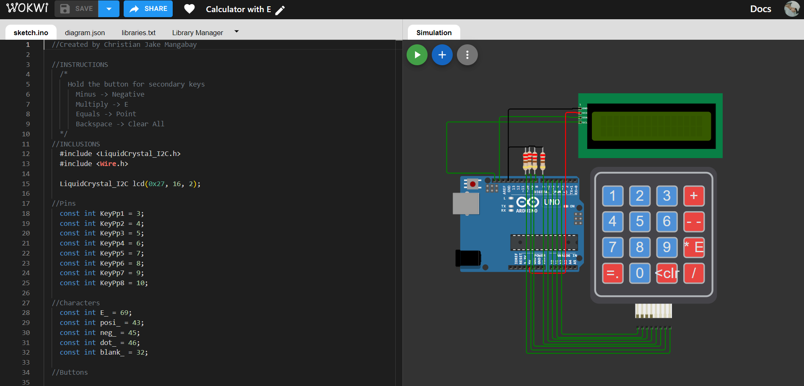

# Arduino-Calculator-withE
An Arduino-based calculator capable of computing up to 50 digits as well as the usage of 'E'.

 </img>
## Overview  
The main constraint it has solved is the limited memory allotment for variables in Arduino which makes the operations for large numbers impossible.
The main technique used is using array variables of integers for numbers instead of single numerical variable. Then, the basic arithmetic of operations in elementary is imitated in codes.
Finally, the calculator can handle operations for large numbers.

## External Simulation
A simulation is available at [Wokwi](https://wokwi.com/projects/367162490897449985).
>  </img>
